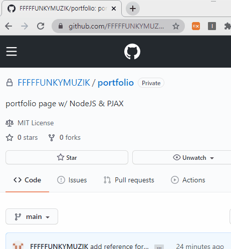
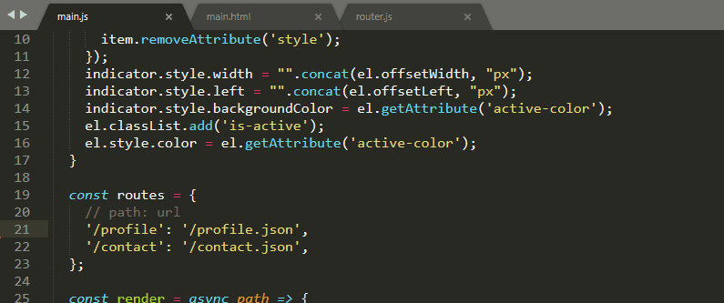
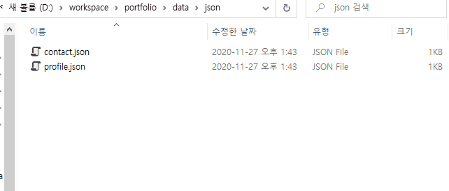
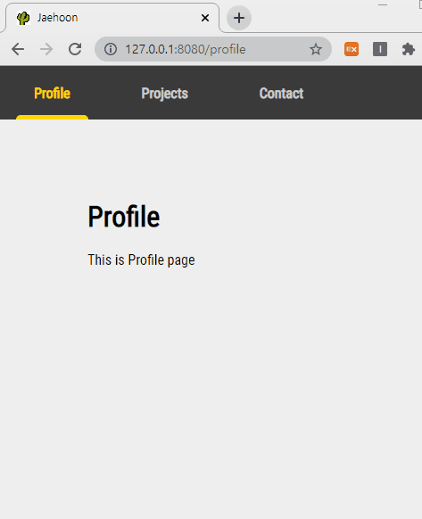
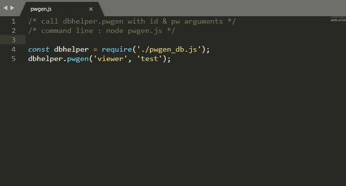

# portfolio-template

This project is reusable, customizable web-base portfolio template.
It utilizes NodeJS & Pjax, MongoDB.

---

## How it looks like

<p align="center">

</p>


---
## Customize

### Add menu & content

If you want to add menus and contents, just edit three files : `main.js`, `main.html`, `router.js`.

<p align="center">

</p>

and then, add json file under `{$Project_root}/portfolio/data/json/` for newly added tab with key `content` like this:

```
{
    'contents' : '<h1><span>Profile</span></h1><p>This is Profile page</p>'
}
```
contents value must follow HTML format.

<p align="center">

</p>
    
then the pages like :

<p align="center">

</p>

<br>

It is also permitted to use html file as contents.

For resource request in HTML, use relative directory to data: like `/image/imagename.jpg`, `/js/jsname.js`.

### Specify your own password

In this projects, user id for storing session and authentication is temporarily defined as `viewer'. Database also stores this user id.

To specify your own password for log-in to the portfolio, modify the arguments and use `pwgen.js`.

<p align="center">

</p>

---
## How to run

    $ npm install
    
    $ node server.js
    or
    $ npm start
    
---
## Reference

  - How to create your first login page with HTML, CSS and JavaScript(https://medium.com/swlh/how-to-create-your-first-login-page-with-html-css-and-javascript-602dd71144f1)
  - Navbar Menu with Underline Hover Effect(https://www.youtube.com/watch?v=agsR08aAO1w)
  - github repo(https://github.com/ungmo2/spa-example)

---
## License

[The MIT License](http://opensource.org/licenses/MIT)

Copyright (c) 2020 Jaehoon
